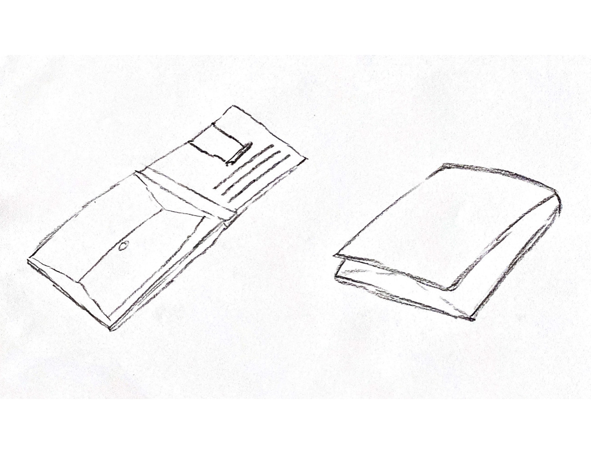
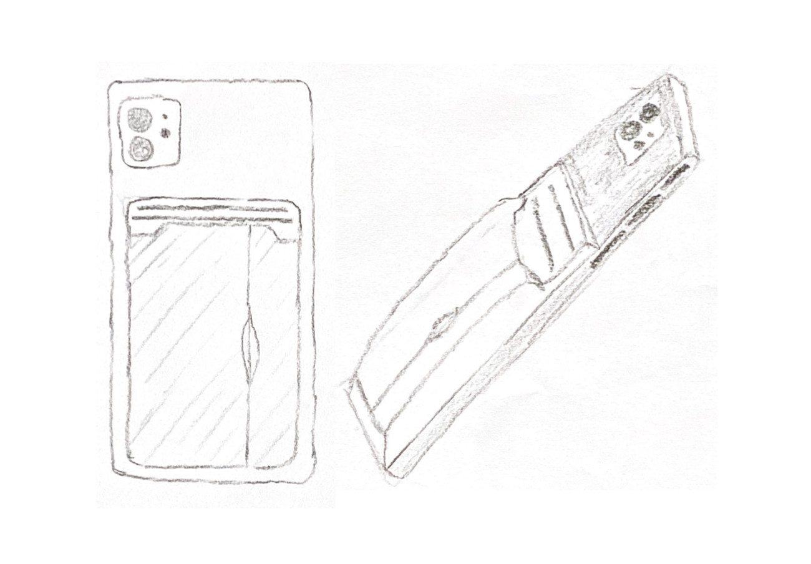
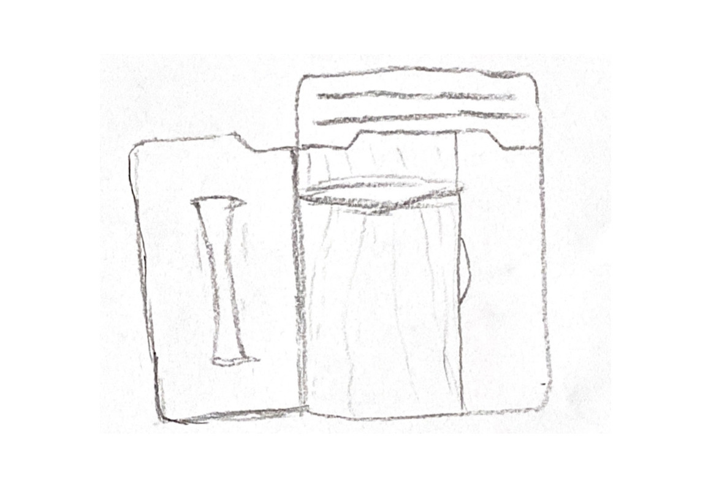

[Zurück zur Auswahl](https://gionegel.github.io/IFD-WiSe20-21/) | [Kurssseite](https://webuser.hs-furtwangen.de/~rag/lehre/WiSe20-21/IFD/Kursinhalt/Team/)

# Aufgabe 1: The Wallet Project (Dokumentation)

## Empathize

### Erkenntnisse aus dem Interview

#### Befragung der Zielgruppe

1. Wo wird die Geldbörse normalerweise untergebracht? *Hosentasche oder Jackentasche*
2. Welche Zahlungsarten werden genutzt? *Fast ausschließlich Kartenzahlung, aber ab und an auch Barzahlung mit Bar- und Münzgeld*
3. Welche Gefahren werden gesehen? *Diebstahl oder Erlangen der Kartendaten*

#### Nutzungskontext

* tagtägliche Nutzung des Produkts im Alltag
* fast ausschließlich Kartenzahlung, ansonsten Barzahlung präferiert
* Geldbörse sollte immer in der Nähe unmittelbar erreichbar sein

### Grundsätzliche Probleme von Geldbörsen

* sehr sperrig, nicht unbedingt handlich in der Unterbringung (Platzmangel)
* im geöffneten/aufgeklappten Zustand sehr groß und unübersichtlich
* Klapp-Mechanismus kann verschleißen
* schwer zu öffnendes Fach für Münzgeld
* Geldscheine können zerknittern oder beschädigt werden

### Aspekte einer idealen Geldbörse (Befragung)

* platzsparen und handlich
* übersichtliche Einteilung mit viel Stauraum, dennoch Kompakt
* schnelles und einfaches Öffnen/Schließen 
* Unterstützung kontaktlosen Bezahlens
* darf nicht verloren gehen (Diebstahl-Schutz)
* Wetter-geschützte Oberfläche

## Define

### Top Findings

* Handlichkeit und Adaption an bestehende Objekte
* Übersichtlichkeit
* Ausreichend Verstaumöglichkeiten
* Diebstahlschutz

### Point Of View

*Ich als Nutzer benötige eine sichere und wertige Geldbörse, die ich mit einem bereits bestehenden Objekt kombinieren kann, das Überschaubar und geräumig ist, um schnell mit Karten oder Bargeld zahlen zu können.*

## Ideate

Features:
* Erweiterung für das bestehende Smartphone (Befestigung über einen Magneten auf der Rückseite)
* Geldbörse ist beschichtet mit Wasser abweisendem, qualitativ hochwertigem Material
* Schutz der Karten vor elektromagnetischer Strahlung des Geräts und Abschrimung von NFC
* einfache Öffnung durch magnetische Schließe und robustem Klapp-Mechanismus der Lasche
* Diebstahlschutz durch implementiertes GPS-Tracking

Funktionsumfang:
* mehrere Karten-Öffnungen für die Unterbringungen
* Netzfach für Münzgeld oder kleinere Wertgegenstände
* elastisches, staffes Band für die Befestigung von Geldscheinen oder weiteren Karten

## Prototype

## Test

## Prototype Iteration

---
[Nach oben &#x25B2;](#top)
