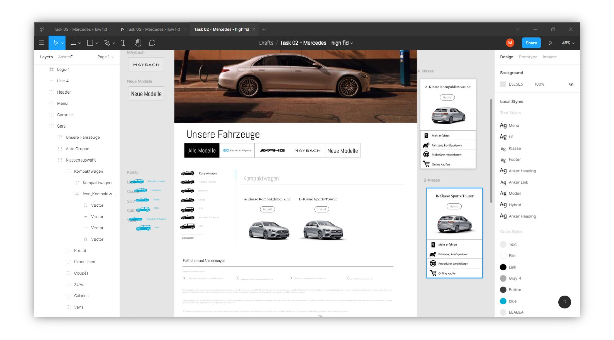
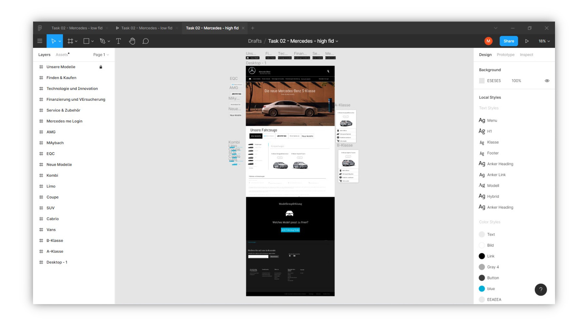
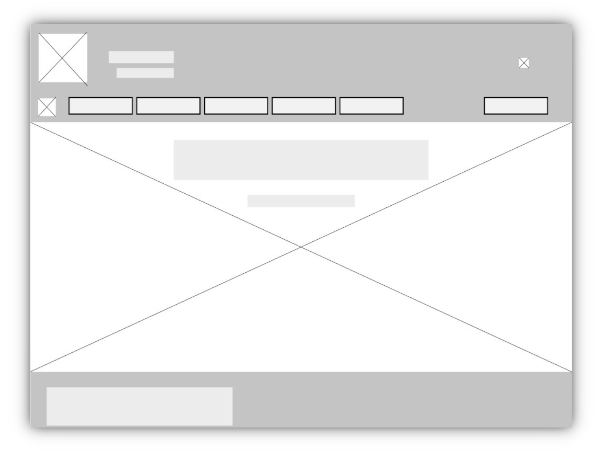

[Zurück zur Auswahl](https://gionegel.github.io/IFD-WiSe20-21/) | [Kurssseite](https://webuser.hs-furtwangen.de/~rag/lehre/WiSe20-21/IFD/Kursinhalt/Team/)

# Aufgabe 2.1: Vorstellung des Prototyp-Tools Figma

erstellt von [Manuel Maringolo](https://github.com/mnlmrngl) und [Gion Egel](https://github.com/gionegel)

## Allgemeine Beschreibung

Bei Figma handelt es sich um ein webbasiertes Layout-Programm, das sowohl als Design-Tool als auch Prototyping-Tool eingesetzt werden kann. Es handelt ich um ein performantes und kostenloses Programm, das die Zusammenarbeit von mehreren Personen ermöglicht. Des weiteren gibt eine ambitionierte Community, die dazu beiträgt, dass sich Figma durch weitere Plug-Ins stetig weiterentwickelt.  

## Kern-Features

* Verknüpfung von mehreren grafisch erzeugten User-Interface-Elementen
* mehrere Interaktionsmöglichkeiten (Mouse-Over und Gestensteuerung)
* Darstellung animierter Bildelemente (z.B. GIFs)
* Erstellen von Präsentationen
* Prototypen können online geteilt werden
* Kommentarfunktion für Betrachter
* Live-Kollaboration ermöglicht Zusammenarbeit mit mehreren Personen
* Dateien lassen sich von anderen Tools importieren und exportieren

## Fidelity

Das Tool eigent sich für die Erstellung von Low- und High-Fidelity-Prototypen. So lassen sich komplexe grafische Elemente und Bilddateien hinzufügen und später mit verschiedene Interaktionen oder Events versehen, sodass die Prototypen interativ funktional sind (hoher Reifegrad). Verschiede Formatgrößen können gezielt angesteuert werden um Responsibilität zu simulieren.

## Komplexität

Die Benutzeroberfläche des Tools ist recht intuitiv und übersichtlich gestaltet. Dabei kann schnell zwischen dem Design- und Prototyping-Modus gewsechselt werden.

**Benutzeroberfläche**

## Beispiele

**Low-Fidelity-Prototyp**

[Link zum Low-Fid](https://www.figma.com/proto/VRBapo5v9hrupV3JxeBxv4/Task-02-Mercedes-low-fid?node-id=1%3A2&scaling=min-zoom)

**High-Fidelity-Prototyp**

[Link zum High-Fid](https://www.figma.com/proto/5qamzk3hJ6mo0P3umbrSkp/Task-02-Mercedes-high-fid?node-id=1%3A2&scaling=min-zoom)

## Einschränkungen

* webbasiertes Programm, daher ist jederzeit eine Internetverbindung notwendig
* eine Vorlage von Platzhalter für Bild-Elemente ist nicht inbegriffen
* Prototyp kann nur online und nicht lokal geteilt werden
* eingeschränkte Export-Möglichkeiten zu anderen Prototyping-Tools
* Anzahl der Projekte ist in der kostenlosen Version beschränkt

## Screencasts (Videos)

[Einen neuen Prototypen erstellen](https://drive.google.com/file/d/10N1krIEyrr6h3huP6o_ypaU2e7Z4I-RP/view)

[Grafische Elemente erzeugen](https://drive.google.com/file/d/1lAbWV2mH-X8pJnKQJuOdnv3lNj6XxCTC/view)

[Mehrere Text-Elemente erstellen](https://drive.google.com/file/d/1-uQraGHP7pCHlYXduYxOcSEgZSvM9h_n/view)

[Einen Hover-Effekt hinzufügen](https://drive.google.com/file/d/1PHO-EWq5Ug2EWyPY6bZ9Y1inqLYPIRNr/view)

---
[Nach oben &#x25B2;](#top)
