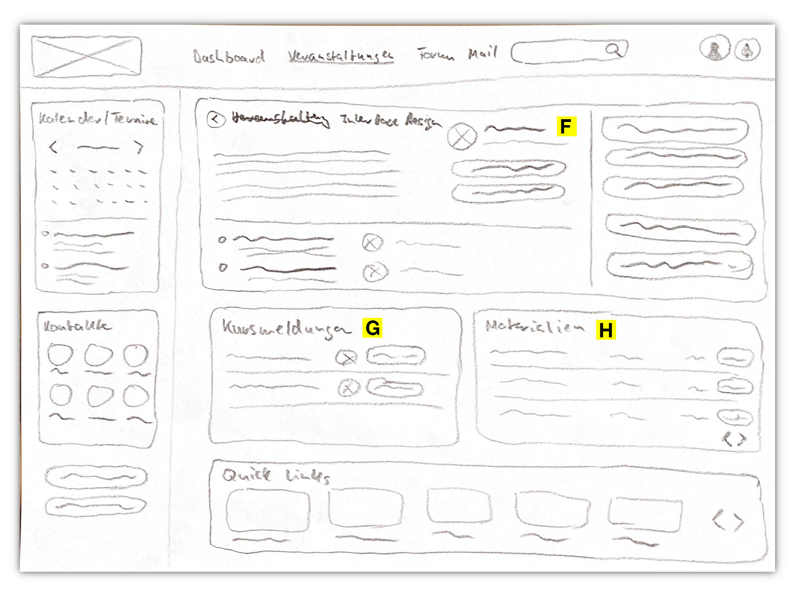

[Zurück zur Auswahl](https://gionegel.github.io/IFD-WiSe20-21/) | [Kurssseite](https://webuser.hs-furtwangen.de/~rag/lehre/WiSe20-21/IFD/Kursinhalt/Team/)

# Aufgabe 2.2: Konzeptentwurf DM-Intranet

### Allgemeine Vorstellung

Meine Vorstellungen sind ein komplexes und überaus funktionales, aber minimalistisch und intuitiv bedienbares Intranet, das sowohl für Studierende als auch Lehrende gut geeignet sein soll. Dabei sollen die jeweiligen Inhalte im Vordergrund stehen und alle relevanten Meldungen direkt kommuniziert werden. Visuell recht anschaulich, aber eher verhalten und nicht allzu sehr an die Corporate Identity der Hochschule gebunden.

## Startseite

### (A) Header und Navigation

Das Intranet soll intuitiver und übersichtlicher erscheinen - deshalb wird nur auf die nötigsten Navigationspunkt zurückgegriffen. Das sind neben dem eigentlichen Dashboard eine Auflistung aller angebotenen Veranstaltungen, Stundenpläne, Prüfungen (ersetzt und übernimmt das Studi-Portal) sowie das Intranet-Forum. Alle weiteren Services werden dann unter (E) in den "Quick-Links" aufgelistet. Außerdem ist hier auch eine Suchleist mit entsprechender Suchfunktion zu finden, daneben eine Profil- und Benachrichtigungs-Funktion. 

### (B) Meine Veranstaltungen

Hier soll sowohl der Studierende als auch der Lehrende die Möglichkeit haben, alle gebuchten und belegten Veranstaltungen auf einer Seite aufgelistet betrachten zu können. Sollte es eine Neuigkeit zur jeweiligen Veranstaltung geben oder neues Material hochgeladen worden sein, so erscheint bereits dort eine visuelle Benachrichtigung. Der Benutzer hat die Möglichkeit, zur jeweiligen Kursseite zu gelangen um mehr Informationen oder den Datei-Ordner einsehen zu können.

### (C) Benachrichtigungen

Diese Funktion soll eine Alternative zu den zahlreichen Mail der Hochschule darstellen und alle wichtigen Meldungen zu den Veranstaltungen, die relevant sein könnten, bündeln. Hier hat der Benutzer folgende Funktionen zur Auswahl:

* Nachricht ansehen
* Absender antworten
* Nachricht/Meldung löschen

So soll das neu aufgesetzte Intranet die zentrale Anlaufstelle für alle wichtigen Informationen sein, die natürlich auf die jeweilige Person zugeschnitten sind. Interaktion soll gefördert werden, indem die Meldungen personenbezogen angezeigt werden.

### (D) Meine Termine

Als eine Art "Side-Bar" soll ein ausführlicher Kalender angezeigt werden, der die wichtigsten Events und Termine der Hochschule, aber auch des Studierenden darstellt. Die nächsten Termine werden bereits auf dem Dashboard angezeigt. Sollte das nicht ausreichen, so hat der Nutzer die Möglichkeit, sich alle Termine anzeigen zu lassen, neue Ereignisse zu erstellen oder zu löschen. Natürlich soll eine Funktion implementiert werden, um den Kalender auszublenden, damit die anderen Inhalte größer dargestellt werden und damit weiter in den Vordergrund rücken.

### (E) Quick-Links

Die wichtigsten Services der Hochschule/Fakultät sollen hier grafisch aufgelistet werden. Das wären Webmail, WPV-Belegung, Felix und die Mensa.

## Kursseite

### (F) Veranstaltung

Hier sind die wichtigsten Informationen zur Veranstaltung zu finden - darunter auch wo und wann diese stattfindet. Außerdem hat man hier die Möglichkeit, Kontakt mit dem Lehrenden aufzunehmen.

### (G) Kursmeldungen

Die wichtigsten vergangenen Meldungen zu diesem Kurs befinden sich hier und werden archiviert.

### (H) Materialien

Dargestellt wie ein Datei-Ordner werden hier die hochgeladenen Materialien aufgelistet. Auch Studierende sollen die Möglichkeit haben, Inhalte in extra erstellten Ordnern hochzuladen und eigene Dokumente zu bearbeiten, während der Lehrende diese einsehen und markieren kann (für eventuelle Rückfragen z.B.). 

---
[Nach oben &#x25B2;](#top)
