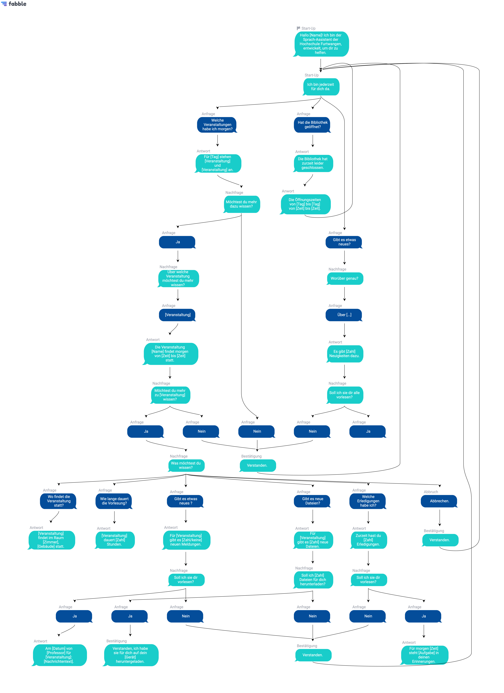

[Zurück zur Auswahl](https://gionegel.github.io/IFD-WiSe20-21/) | [Kurssseite](https://webuser.hs-furtwangen.de/~rag/lehre/WiSe20-21/IFD/Kursinhalt/Team/)

# Aufgabe 4: Konzeptentwurf Voice User Interface

---
[Nach oben &#x25B2;](#top)
