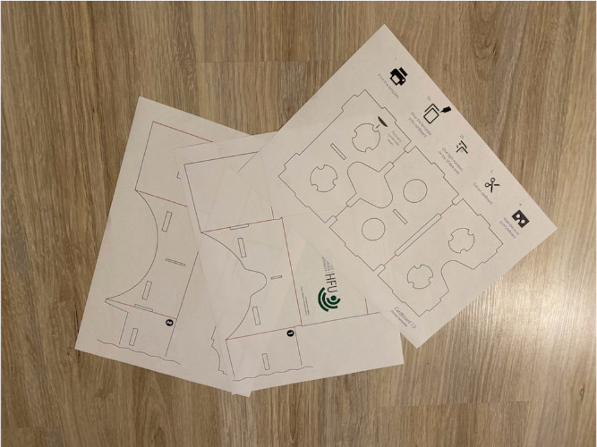
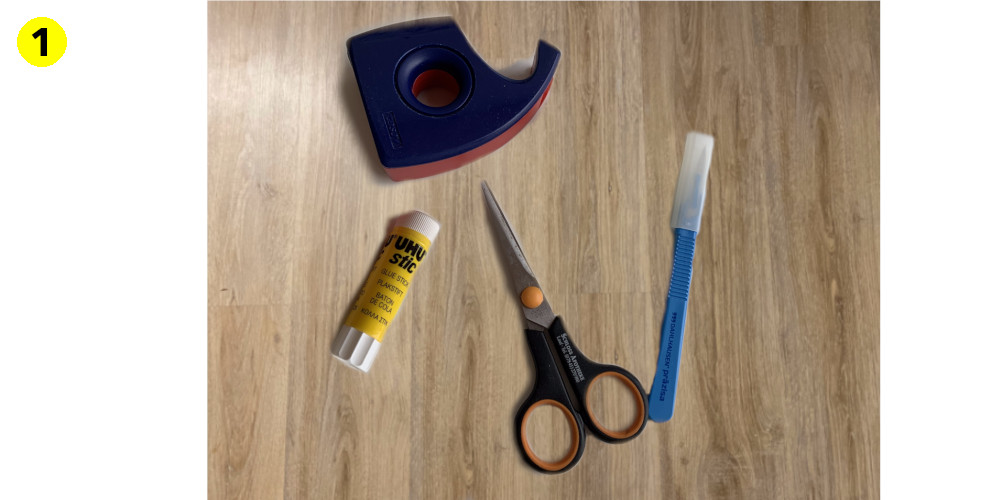
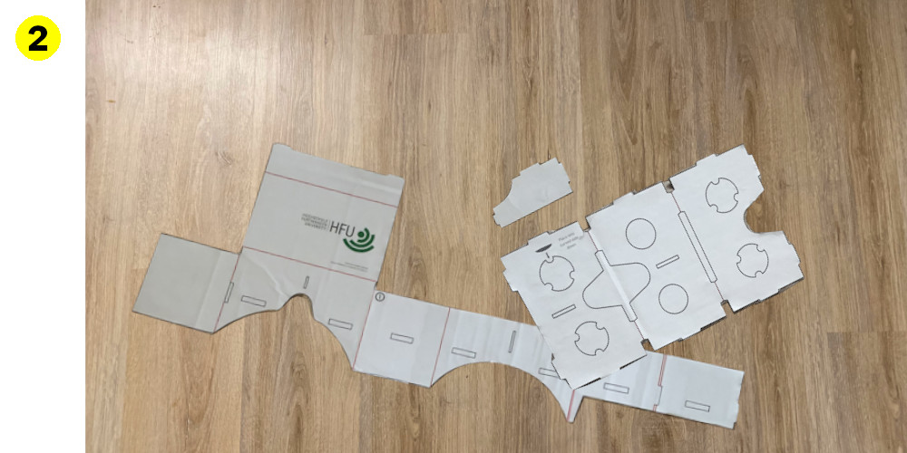
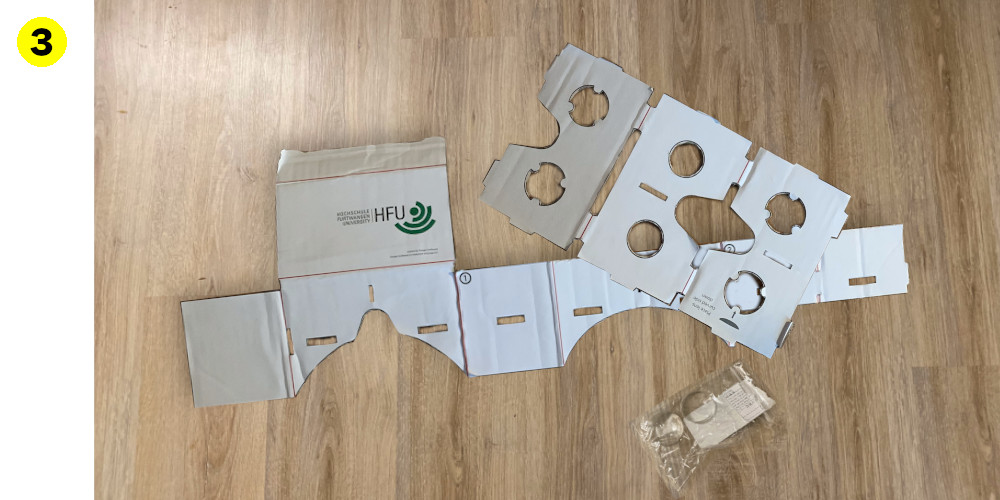
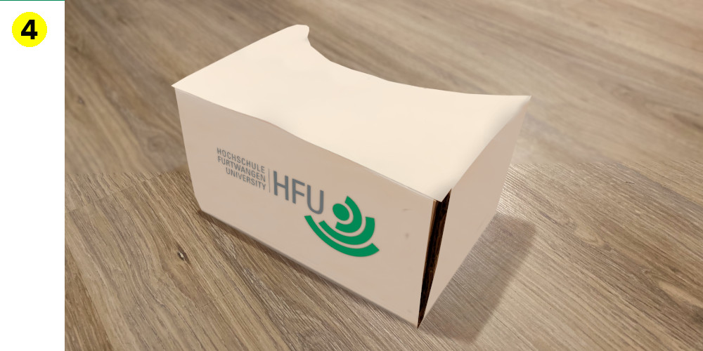

[Zurück zur Auswahl](https://gionegel.github.io/IFD-WiSe20-21/) | [Kurssseite](https://webuser.hs-furtwangen.de/~rag/lehre/WiSe20-21/IFD/Kursinhalt/Team/)

# Aufgabe 8: VR-Cardboard-Brille

## Vorbereitung

* Kleber

* Tesa-Film

* Schere

* Skalpell bzw. Cutter-Messer

* Versandkarton

* Vorlage des VR-Cardboards

## Dokumentation zum Aufbau

---
[Nach oben &#x25B2;](#top)
