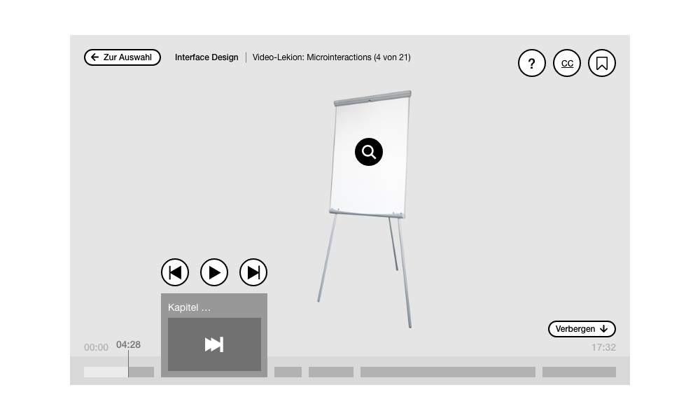
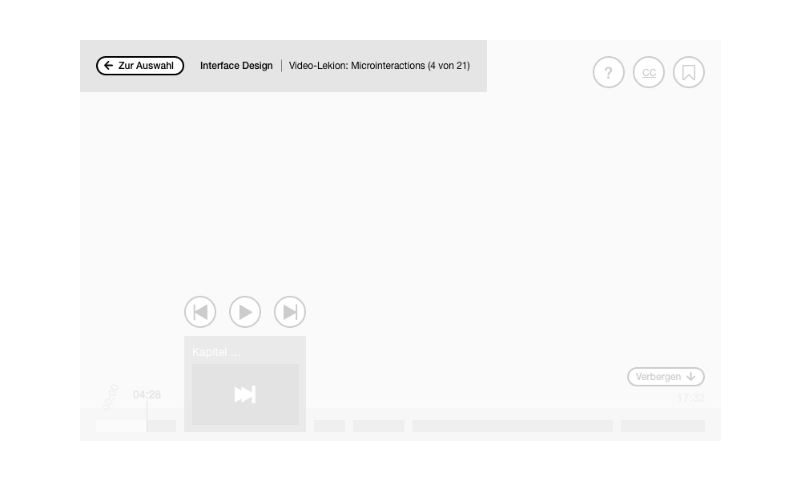
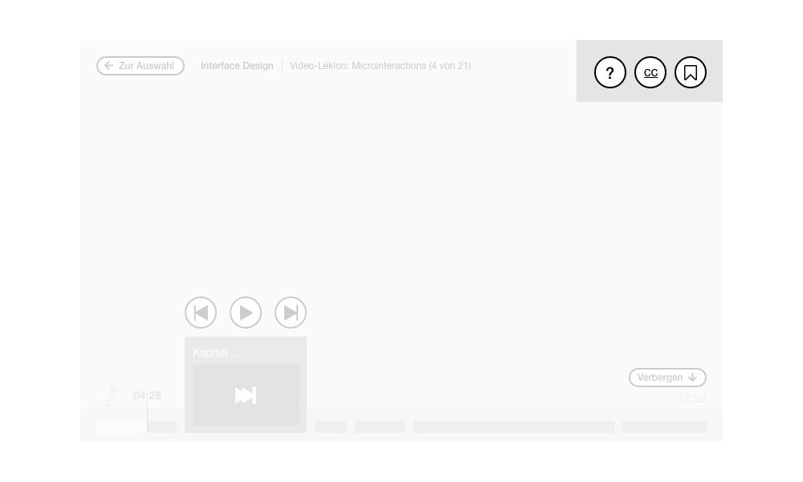
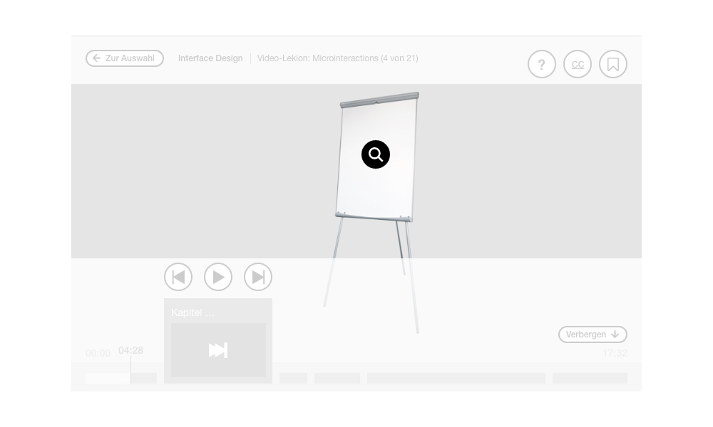
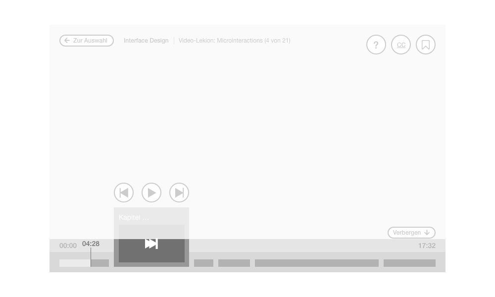
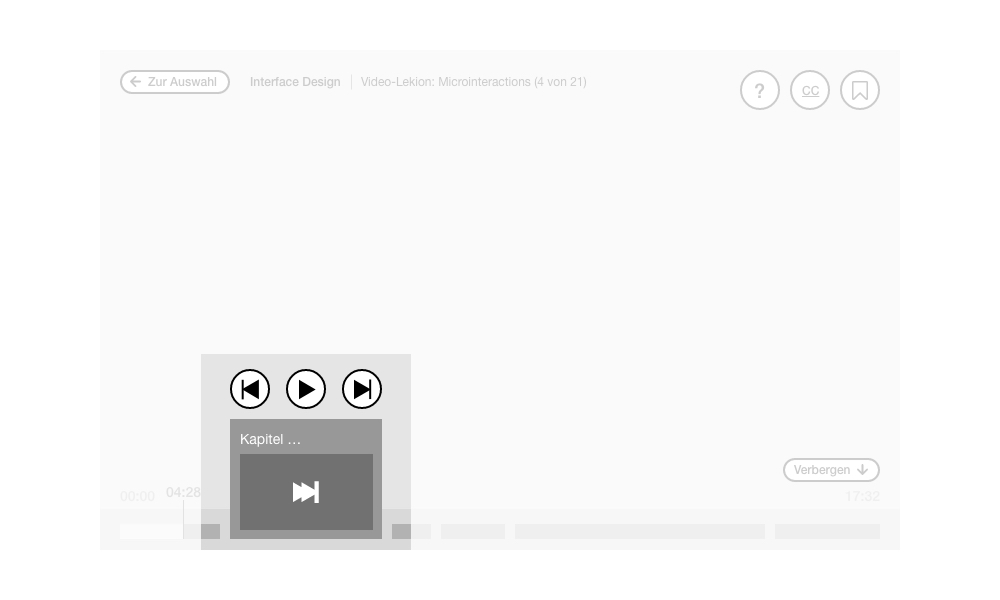

[Zurück zur Auswahl](https://gionegel.github.io/IFD-WiSe20-21/) | [Kurssseite](https://webuser.hs-furtwangen.de/~rag/lehre/WiSe20-21/IFD/Kursinhalt/Team/)

# Aufgabe 9: Virtual Immersive Lecture (Prototyp/Storyboard)

## Überlegungen

Das Interface für die VR-Brille soll dem Nutzer viele Informationen übermitteln, die er je nach Bedarf sich anzeigen lassen kann. Wichtig erscheint es mir, darauf zu achten, dass die zusätzlichen Informationen nicht zu sehr im Vordergrund stehen und vom eigentlichen Video-Inhalt ablenken. So sollen die zusätzlichen Funktionen  das bestehnende inhaltliche Angebot nicht ersetzen, sondern nur sinnvoll ergänzen. Funktionen müssen leicht verständlich und intuitiv implementiert werden, ohne zu viel Raum einzunehmen, der bereits durch das Gerät selbst begrenzt ist.

[Video-Vorschau](#)

## Überblick

Grob orientiert habe ich mich an bestehende Video-Player, die allerdings eindimensional sind. Daher ist eine Adaption auf die dreidimensionale Betrachtung notwending, um das Erlebnis des Betrachtenden zu verbessern und somit ein in sich stimmiges Interface zu schaffen.

Alle hier abgebildeten Komponenten sind 3D-Elemente. Das bedeutet, dass sich die einzelnen Grafiken je nach Bewegung oder Neigung des Nutzers minimal mitbewegen, um den Eindruck des Immersiven zu vermitteln.

## Funktionen & Aufbau

### Header-Bereich

Wurde ein Video-Inhalt vom Nutzer ausgewählt, so ist jederzeit eine Rückkehr zur Auswahl zu den gelisteten Videos möglich, damit der Nutzer auch zügig zwischen den Inhalten wechseln kann. Daneben befindet sich die Information zur Veranstaltung sowie zum Thema, das hier behandelt wird. 

* **Mehr Erfahren:** Nutzer bekommt ein Layout mit weiteren Informationen zur Veranstaltung oder zu den Videoinhalten.
* **Untertitel:** Nutzer bekommt automatisch erstellte Untertitel angezeigt.
* **Lesezeichen:** Das Video kann sich als Lesezeichen eingespeichert werden und später an der gleichen Stelle weitergeschaut werden.

### Interaktion

Über speziell erscheinende Elemente kann der Nutzer je nach Kontext interagieren. In deisem Fall wird verdeutlicht, dass er jetzt darüber erfahren kann. So bekommt er bspw. Keyfacts, Daten oder einen erklärenden Test visuelle dargestellt. Auch hier sind die Elemente an das jeweilige reale Objekt durch Motion Tracking verbunden und bleiben trotz Bewegung statisch an der gleichen Stelle.  

### Time Line

Die Zeitleiste teilt die im Video vorkommenden Themen oder Informationen in verschiedene Kapitel ein und stellt sie als Abschnitte unten dar. Hovert oder betrachtet der Nutzer das jeweilige Kapitel (den Time Stamp), so vergrößert sich das Element und es erscheint der Titel sowie ein Vorschaubild dieser Stelle. Der Nutzer hat die Möglichkeit, an die jeweilige Stelle des Kapitel zu springen, kann aber auch durch die Auswahl der Zeitleiste selbst im Video navigieren. Außerdem bekommt der Nutzer den aktuellen Fortschritt des Videos mit Zeitangabe (aktuelle Video-Zeit, Anfangs- und Endzeit) angezeigt.

Standardfunktionen:
* Play/Stopp
* zum Video-Anfang bzw. zum vorigen Video
* zum nächsten Video

Die zeitleiste kann auch komplett verborgen werden, was besonders bei kürzeren Videos sinnvoll scheint.

---
[Nach oben &#x25B2;](#top)
